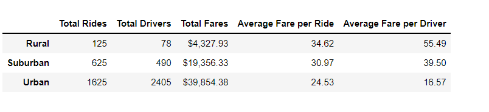

# PyBer_Analysis

 ## Overview of the analysis:

Creation of summary dataFrame of the ride sharing data by city type using Python skills and knowledge of Pandas. In addition, by using Pandas and Matplotlib, multiple-line graph should be created that reflects total weekly fares for each city type.

 ## Results:

There is a description of the differences in ride-sharing data among the different city types. Ride-sharing data include the total rides, total drivers, total fares, average fare per ride and driver, and total fare by city type. 

 

There is lot of rides activity(Rides and drivers) in urban areas. Average fares are higher as the number of rides are lot less in suburban areas and the least in rural areas.
  
 

  Fares are highest for urban areas, followed by  suburban and then rural areas. General trend is that there is a hike in fares during later part of Febrauary. There are fewer fluctuations for suburban areas as compared to urban and rural areas.

 ## Summary:

There is a statement summarizing three business recommendations to the CEO for addressing any disparities among the city types. 

** Since Urban areas are the busiest, offer some discounts and schemes which will encourage more folks to use the rides facility. Also to encourage ride sharing.

** It is more important to provide schemes in suburban areas and a little more marketing to get folks to use the services
 
** In rural areas, more drivers are needed and more discounts to get people started on using these services on a regular basis

